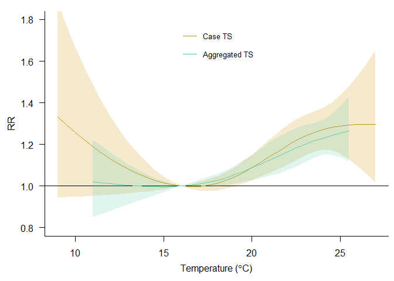
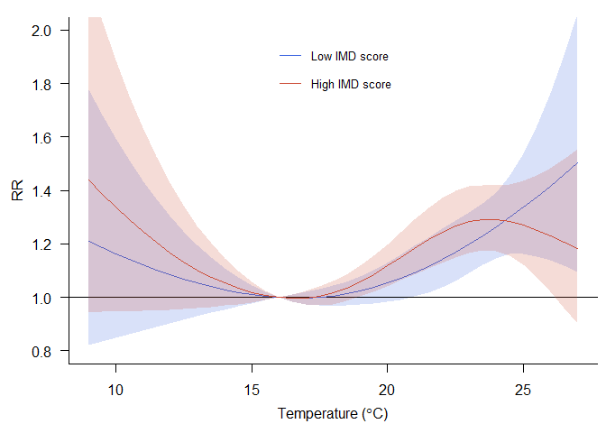

MAIN MODEL ON CASE TIME SERIES DATA
================

``` r
pacman::p_load(
  rio,            # import and export files
  here,           # locate files 
  tidyverse,      # data management and visualization
  gnm,
  dlnm,
  splines
)
```

# Data

``` r
# data #-----------
```

## MSOA data

``` r
## MSOA data #--------------------------------
(datafull_0 <- rio::import(here("note_lehuynh/data_full_temperature.csv")) %>% 
  tibble())
```

    ## # A tibble: 180,872 × 12
    ##    MSOA11CD  date        d074 d75plus MSOA11NM            dtot  year month   day   doy   dow tmean
    ##    <chr>     <IDate>    <int>   <int> <chr>              <int> <int> <int> <int> <int> <int> <dbl>
    ##  1 E02000001 2006-06-01     0       0 City of London 001     0  2006     6     1   152     5  11.6
    ##  2 E02000001 2006-06-02     0       0 City of London 001     0  2006     6     2   153     6  14.8
    ##  3 E02000001 2006-06-03     0       0 City of London 001     0  2006     6     3   154     7  17.1
    ##  4 E02000001 2006-06-04     0       0 City of London 001     0  2006     6     4   155     1  17.1
    ##  5 E02000001 2006-06-05     0       0 City of London 001     0  2006     6     5   156     2  16.5
    ##  6 E02000001 2006-06-06     0       0 City of London 001     0  2006     6     6   157     3  14.9
    ##  7 E02000001 2006-06-07     0       0 City of London 001     0  2006     6     7   158     4  18.7
    ##  8 E02000001 2006-06-08     0       0 City of London 001     0  2006     6     8   159     5  20.6
    ##  9 E02000001 2006-06-09     0       0 City of London 001     0  2006     6     9   160     6  20.1
    ## 10 E02000001 2006-06-10     0       1 City of London 001     1  2006     6    10   161     7  21.7
    ## # ℹ 180,862 more rows

Define the strata

``` r
(datafull_1 <- datafull_0 %>% 
  mutate(across(c(MSOA11CD, year, month), 
                as.factor),
         stratum = factor(paste(MSOA11CD, year, month, sep = ":"))) %>% 
  select(MSOA11CD,
         date,
         doy,
         dow,
         stratum,
         d074,
         d75plus,
         dtot,
         tmean,
         year,
         month,
         day))
```

    ## # A tibble: 180,872 × 12
    ##    MSOA11CD  date         doy   dow stratum           d074 d75plus  dtot tmean year  month   day
    ##    <fct>     <IDate>    <int> <int> <fct>            <int>   <int> <int> <dbl> <fct> <fct> <int>
    ##  1 E02000001 2006-06-01   152     5 E02000001:2006:6     0       0     0  11.6 2006  6         1
    ##  2 E02000001 2006-06-02   153     6 E02000001:2006:6     0       0     0  14.8 2006  6         2
    ##  3 E02000001 2006-06-03   154     7 E02000001:2006:6     0       0     0  17.1 2006  6         3
    ##  4 E02000001 2006-06-04   155     1 E02000001:2006:6     0       0     0  17.1 2006  6         4
    ##  5 E02000001 2006-06-05   156     2 E02000001:2006:6     0       0     0  16.5 2006  6         5
    ##  6 E02000001 2006-06-06   157     3 E02000001:2006:6     0       0     0  14.9 2006  6         6
    ##  7 E02000001 2006-06-07   158     4 E02000001:2006:6     0       0     0  18.7 2006  6         7
    ##  8 E02000001 2006-06-08   159     5 E02000001:2006:6     0       0     0  20.6 2006  6         8
    ##  9 E02000001 2006-06-09   160     6 E02000001:2006:6     0       0     0  20.1 2006  6         9
    ## 10 E02000001 2006-06-10   161     7 E02000001:2006:6     0       1     1  21.7 2006  6        10
    ## # ℹ 180,862 more rows

Generate `ind`: sum of events within stratum

``` r
(ind_df <- datafull_1 %>% group_by(stratum) %>% summarise(ind = sum(dtot)))
```

    ## # A tibble: 5,898 × 2
    ##    stratum            ind
    ##    <fct>            <int>
    ##  1 E02000001:2006:6     3
    ##  2 E02000001:2006:7     2
    ##  3 E02000001:2006:8     7
    ##  4 E02000001:2013:6     0
    ##  5 E02000001:2013:7     4
    ##  6 E02000001:2013:8     0
    ##  7 E02000002:2006:6     7
    ##  8 E02000002:2006:7     2
    ##  9 E02000002:2006:8     8
    ## 10 E02000002:2013:6     6
    ## # ℹ 5,888 more rows

``` r
(datafull <- datafull_1 %>% left_join(ind_df, by = join_by(stratum)))
```

    ## # A tibble: 180,872 × 13
    ##    MSOA11CD  date         doy   dow stratum          d074 d75plus  dtot tmean year  month   day   ind
    ##    <fct>     <IDate>    <int> <int> <fct>           <int>   <int> <int> <dbl> <fct> <fct> <int> <int>
    ##  1 E02000001 2006-06-01   152     5 E02000001:2006…     0       0     0  11.6 2006  6         1     3
    ##  2 E02000001 2006-06-02   153     6 E02000001:2006…     0       0     0  14.8 2006  6         2     3
    ##  3 E02000001 2006-06-03   154     7 E02000001:2006…     0       0     0  17.1 2006  6         3     3
    ##  4 E02000001 2006-06-04   155     1 E02000001:2006…     0       0     0  17.1 2006  6         4     3
    ##  5 E02000001 2006-06-05   156     2 E02000001:2006…     0       0     0  16.5 2006  6         5     3
    ##  6 E02000001 2006-06-06   157     3 E02000001:2006…     0       0     0  14.9 2006  6         6     3
    ##  7 E02000001 2006-06-07   158     4 E02000001:2006…     0       0     0  18.7 2006  6         7     3
    ##  8 E02000001 2006-06-08   159     5 E02000001:2006…     0       0     0  20.6 2006  6         8     3
    ##  9 E02000001 2006-06-09   160     6 E02000001:2006…     0       0     0  20.1 2006  6         9     3
    ## 10 E02000001 2006-06-10   161     7 E02000001:2006…     0       1     1  21.7 2006  6        10     3
    ## # ℹ 180,862 more rows

## Aggregated data

``` r
## aggregated data #-------------------------------
(dataggr <- rio::import(here("note_lehuynh/data_aggregated_temperature.csv")) %>% 
  tibble())
```

    ## # A tibble: 184 × 10
    ##    date        d074 d75plus  dtot  year month   day   doy   dow tmean
    ##    <IDate>    <int>   <int> <int> <int> <int> <int> <int> <int> <dbl>
    ##  1 2006-06-01    45      72   117  2006     6     1   152     5  10.9
    ##  2 2006-06-02    51     108   159  2006     6     2   153     6  14.6
    ##  3 2006-06-03    45      85   130  2006     6     3   154     7  16.4
    ##  4 2006-06-04    51      88   139  2006     6     4   155     1  16.4
    ##  5 2006-06-05    55      74   129  2006     6     5   156     2  15.9
    ##  6 2006-06-06    56      78   134  2006     6     6   157     3  14.4
    ##  7 2006-06-07    58      78   136  2006     6     7   158     4  18.0
    ##  8 2006-06-08    62      74   136  2006     6     8   159     5  19.8
    ##  9 2006-06-09    61      82   143  2006     6     9   160     6  19.2
    ## 10 2006-06-10    57      95   152  2006     6    10   161     7  21.1
    ## # ℹ 174 more rows

# Model fitting

``` r
# model fitting #-----------
```

## MSOA data

``` r
## MSOA data #--------------------------------
# DEFINE SPLINES OF DAY OF THE YEAR
spldoy <- onebasis(datafull$doy, "ns", df=3)
summary(spldoy)
```

    ## BASIS FUNCTION
    ## observations: 180872 
    ## range: 152 243 
    ## df: 3 
    ## fun: ns 
    ## knots: 182 213 
    ## intercept: FALSE 
    ## Boundary.knots: 152 243

``` r
# DEFINE THE CROSS-BASIS FOR TEMPERATURE FROM THE EXPOSURE HISTORY MATRIX
# NB: USE group TO IDENTIFY LACK OF CONTINUITY IN SERIES BY MSOA AND YEAR
argvar <- list(fun = "ns", knots = quantile(datafull$tmean, c(50, 90) / 100, na.rm = T))
arglag <- list(fun = "ns", knots = 1)

# group = factor(MSOA-year)
group <- factor(paste(datafull$MSOA11CD, datafull$year, sep = "-"))
length(group)
```

    ## [1] 180872

``` r
head(group)
```

    ## [1] E02000001-2006 E02000001-2006 E02000001-2006 E02000001-2006 E02000001-2006 E02000001-2006
    ## 1966 Levels: E02000001-2006 E02000001-2013 E02000002-2006 E02000002-2013 ... E02006931-2013

``` r
cbtmean <- crossbasis(datafull$tmean,
                      lag = 3, 
                      argvar = argvar, 
                      arglag = arglag,
                      group = group)

summary(cbtmean)
```

    ## CROSSBASIS FUNCTIONS
    ## observations: 180872 
    ## groups: 1966 
    ## range: 8.551893 to 27.17635 
    ## lag period: 0 3 
    ## total df:  9 
    ## 
    ## BASIS FOR VAR:
    ## fun: ns 
    ## knots: 18.27253 22.91653 
    ## intercept: FALSE 
    ## Boundary.knots: 8.551893 27.17635 
    ## 
    ## BASIS FOR LAG:
    ## fun: ns 
    ## knots: 1 
    ## intercept: TRUE 
    ## Boundary.knots: 0 3

``` r
# model fitting
modfull <- gnm(dtot ~ cbtmean + spldoy:factor(year) + factor(dow), 
               eliminate = stratum, 
               data = datafull, 
               family = quasipoisson, 
               subset = ind > 0)

summary(modfull)
```

    ## 
    ## Call:
    ## gnm(formula = dtot ~ cbtmean + spldoy:factor(year) + factor(dow), 
    ##     eliminate = stratum, family = quasipoisson, data = datafull,     subset = ind > 0)
    ## 
    ## Deviance Residuals: 
    ##     Min       1Q   Median       3Q      Max  
    ## -1.2074  -0.5632  -0.4500  -0.3395   3.8816  
    ## 
    ## Coefficients of interest:
    ##                            Estimate Std. Error t value Pr(>|t|)   
    ## cbtmeanv1.l1              -0.003663   0.125338  -0.029  0.97669   
    ## cbtmeanv1.l2               0.088437   0.062169   1.423  0.15488   
    ## cbtmeanv1.l3              -0.172436   0.065952  -2.615  0.00893 **
    ## cbtmeanv2.l1              -0.210509   0.426390  -0.494  0.62152   
    ## cbtmeanv2.l2              -0.153488   0.265505  -0.578  0.56320   
    ## cbtmeanv2.l3              -0.360522   0.224083  -1.609  0.10764   
    ## cbtmeanv3.l1              -0.108577   0.145496  -0.746  0.45551   
    ## cbtmeanv3.l2               0.185967   0.086221   2.157  0.03102 * 
    ## cbtmeanv3.l3              -0.194610   0.081405  -2.391  0.01682 * 
    ## factor(dow)2               0.004140   0.025936   0.160  0.87317   
    ## factor(dow)3               0.020476   0.026595   0.770  0.44134   
    ## factor(dow)4              -0.027980   0.027442  -1.020  0.30792   
    ## factor(dow)5              -0.041657   0.026552  -1.569  0.11667   
    ## factor(dow)6               0.016669   0.026216   0.636  0.52489   
    ## factor(dow)7               0.019495   0.025935   0.752  0.45225   
    ## spldoyb1:factor(year)2006 -0.104383   0.091089  -1.146  0.25182   
    ## spldoyb2:factor(year)2006 -0.076555   0.153179  -0.500  0.61723   
    ## spldoyb3:factor(year)2006 -0.021808   0.093549  -0.233  0.81567   
    ## spldoyb1:factor(year)2013 -0.166538   0.101287  -1.644  0.10013   
    ## spldoyb2:factor(year)2013 -0.037906   0.195219  -0.194  0.84604   
    ## spldoyb3:factor(year)2013  0.009675   0.094106   0.103  0.91812   
    ## ---
    ## Signif. codes:  0 '***' 0.001 '**' 0.01 '*' 0.05 '.' 0.1 ' ' 1
    ## 
    ## (Dispersion parameter for quasipoisson family taken to be 1.000459)
    ## 
    ## Residual deviance: 87258 on 162757 degrees of freedom
    ## AIC: NA
    ## 
    ## Number of iterations: 2

## Aggregated data

``` r
## aggregated data #-------------------------------
# RE-DEFINE THE CROSS-BASIS WITH THE SAME PARAMETRISATION
# NB: CAN USE SERIES DIRECTLY INSTEAD THAN MATRIX, BUT USE group FOR YEARS
cbtmeanaggr <- crossbasis(dataggr$tmean,
                          lag = 3, 
                          argvar = argvar, 
                          arglag = arglag,
                          group = dataggr$year)
summary(cbtmeanaggr)
```

    ## CROSSBASIS FUNCTIONS
    ## observations: 184 
    ## groups: 2 
    ## range: 10.94046 to 25.84667 
    ## lag period: 0 3 
    ## total df:  9 
    ## 
    ## BASIS FOR VAR:
    ## fun: ns 
    ## knots: 18.27253 22.91653 
    ## intercept: FALSE 
    ## Boundary.knots: 10.94046 25.84667 
    ## 
    ## BASIS FOR LAG:
    ## fun: ns 
    ## knots: 1 
    ## intercept: TRUE 
    ## Boundary.knots: 0 3

``` r
# RUN THE MODEL ON AGGREGATED DATA
modaggr <- glm(dtot ~ cbtmeanaggr + ns(doy, df = 3):factor(year) + factor(dow),
               data = dataggr, 
               family = quasipoisson)

summary(modaggr)
```

    ## 
    ## Call:
    ## glm(formula = dtot ~ cbtmeanaggr + ns(doy, df = 3):factor(year) + 
    ##     factor(dow), family = quasipoisson, data = dataggr)
    ## 
    ## Coefficients:
    ##                                     Estimate Std. Error t value Pr(>|t|)    
    ## (Intercept)                        4.9111137  0.0775891  63.296  < 2e-16 ***
    ## cbtmeanaggrv1.l1                   0.0007469  0.1066669   0.007 0.994422    
    ## cbtmeanaggrv1.l2                   0.1330015  0.0399807   3.327 0.001096 ** 
    ## cbtmeanaggrv1.l3                  -0.1303566  0.0569528  -2.289 0.023430 *  
    ## cbtmeanaggrv2.l1                   0.0356536  0.3059613   0.117 0.907383    
    ## cbtmeanaggrv2.l2                   0.1548950  0.1412681   1.096 0.274567    
    ## cbtmeanaggrv2.l3                  -0.2750218  0.1592287  -1.727 0.086109 .  
    ## cbtmeanaggrv3.l1                  -0.0132214  0.1101050  -0.120 0.904574    
    ## cbtmeanaggrv3.l2                   0.1892219  0.0435557   4.344 2.51e-05 ***
    ## cbtmeanaggrv3.l3                  -0.1583888  0.0574982  -2.755 0.006574 ** 
    ## factor(dow)2                       0.0053402  0.0287620   0.186 0.852946    
    ## factor(dow)3                       0.0251156  0.0295259   0.851 0.396279    
    ## factor(dow)4                      -0.0243638  0.0305525  -0.797 0.426408    
    ## factor(dow)5                      -0.0417654  0.0295330  -1.414 0.159299    
    ## factor(dow)6                       0.0128063  0.0290893   0.440 0.660373    
    ## factor(dow)7                       0.0153566  0.0286629   0.536 0.592883    
    ## ns(doy, df = 3)1:factor(year)2006 -0.1163399  0.0496972  -2.341 0.020499 *  
    ## ns(doy, df = 3)2:factor(year)2006 -0.1245087  0.1059928  -1.175 0.241909    
    ## ns(doy, df = 3)3:factor(year)2006  0.0201842  0.0405824   0.497 0.619633    
    ## ns(doy, df = 3)1:factor(year)2013 -0.2595542  0.0598748  -4.335 2.60e-05 ***
    ## ns(doy, df = 3)2:factor(year)2013 -0.3531792  0.0963282  -3.666 0.000337 ***
    ## ns(doy, df = 3)3:factor(year)2013 -0.0552921  0.0425170  -1.300 0.195358    
    ## ---
    ## Signif. codes:  0 '***' 0.001 '**' 0.01 '*' 0.05 '.' 0.1 ' ' 1
    ## 
    ## (Dispersion parameter for quasipoisson family taken to be 1.236377)
    ## 
    ##     Null deviance: 385.82  on 177  degrees of freedom
    ## Residual deviance: 193.78  on 156  degrees of freedom
    ##   (6 observations deleted due to missingness)
    ## AIC: NA
    ## 
    ## Number of Fisher Scoring iterations: 4

## PREDICT AND PLOT

``` r
## predict and plot #------------------------
# PREDICT
cpfull <- crosspred(cbtmean, modfull, cen = 16)
cpaggr <- crosspred(cbtmeanaggr, modaggr, cen = 16)

# PLOT
col <- c("darkgoldenrod3", "aquamarine3")
parold <- par(no.readonly = T)

par(mar = c(4, 4, 1, 0.5), 
    las = 1, 
    mgp = c(2.5, 1, 0))

plot(cpfull, "overall",
  ylim = c(0.8, 1.8), 
  ylab = "RR", 
  col = col[1], 
  lwd = 1.5,
  xlab = expression(paste("Temperature (" * degree, "C)")),
  ci.arg = list(col = alpha(col[1], 0.2)))

lines(cpaggr, "overall",
  ci = "area", 
  col = col[2], 
  lwd = 1.5,
  ci.arg = list(col = alpha(col[2], 0.2)))

legend("top", c("Case TS", "Aggregated TS"),
  lty = 1, 
  lwd = 1.5, 
  col = col, 
  bty = "n",
  inset = 0.05, 
  y.intersp = 2, 
  cex = 0.8)
```

<!-- -->

``` r
par(parold)
```

# INTERACTION MODELS

``` r
# interaction models #----------------------------
```

## Data

``` r
## data #-----------
(df_imd <- rio::import(here("note_lehuynh/data_full_imd.csv")) %>% 
   tibble() %>% 
   select(MSOA11CD,
          imdscore,
          imdrank) %>% 
   distinct())
```

    ## # A tibble: 983 × 3
    ##    MSOA11CD  imdscore imdrank
    ##    <chr>        <dbl>   <dbl>
    ##  1 E02000001     14.3  20373.
    ##  2 E02000002     38.3   5390.
    ##  3 E02000003     25.4  10974 
    ##  4 E02000004     24.9  11586.
    ##  5 E02000005     32.9   7149 
    ##  6 E02000007     41.1   4664 
    ##  7 E02000008     35.8   5918 
    ##  8 E02000009     35.8   5966.
    ##  9 E02000010     37.6   5300.
    ## 10 E02000011     25.7  10549.
    ## # ℹ 973 more rows

``` r
df_imd %>% 
  count(MSOA11CD, imdscore, imdrank) %>% 
  arrange(MSOA11CD) %>% 
  print(n = 20)
```

    ## # A tibble: 983 × 4
    ##    MSOA11CD  imdscore imdrank     n
    ##    <chr>        <dbl>   <dbl> <int>
    ##  1 E02000001     14.3  20373.     1
    ##  2 E02000002     38.3   5390.     1
    ##  3 E02000003     25.4  10974      1
    ##  4 E02000004     24.9  11586.     1
    ##  5 E02000005     32.9   7149      1
    ##  6 E02000007     41.1   4664      1
    ##  7 E02000008     35.8   5918      1
    ##  8 E02000009     35.8   5966.     1
    ##  9 E02000010     37.6   5300.     1
    ## 10 E02000011     25.7  10549.     1
    ## 11 E02000012     20.0  14352      1
    ## 12 E02000013     38.5   4971      1
    ## 13 E02000014     39.3   4745.     1
    ## 14 E02000015     42.9   3814.     1
    ## 15 E02000016     37.2   5519.     1
    ## 16 E02000017     28.6   9065.     1
    ## 17 E02000018     38.4   5186.     1
    ## 18 E02000019     35.0   6246.     1
    ## 19 E02000020     33.7   6653.     1
    ## 20 E02000021     33.4   6956      1
    ## # ℹ 963 more rows

``` r
(datafull_int <- datafull %>% left_join(df_imd, by = join_by(MSOA11CD)))
```

    ## # A tibble: 180,872 × 15
    ##    MSOA11CD date         doy   dow stratum  d074 d75plus  dtot tmean year  month   day   ind imdscore
    ##    <chr>    <IDate>    <int> <int> <fct>   <int>   <int> <int> <dbl> <fct> <fct> <int> <int>    <dbl>
    ##  1 E020000… 2006-06-01   152     5 E02000…     0       0     0  11.6 2006  6         1     3     14.3
    ##  2 E020000… 2006-06-02   153     6 E02000…     0       0     0  14.8 2006  6         2     3     14.3
    ##  3 E020000… 2006-06-03   154     7 E02000…     0       0     0  17.1 2006  6         3     3     14.3
    ##  4 E020000… 2006-06-04   155     1 E02000…     0       0     0  17.1 2006  6         4     3     14.3
    ##  5 E020000… 2006-06-05   156     2 E02000…     0       0     0  16.5 2006  6         5     3     14.3
    ##  6 E020000… 2006-06-06   157     3 E02000…     0       0     0  14.9 2006  6         6     3     14.3
    ##  7 E020000… 2006-06-07   158     4 E02000…     0       0     0  18.7 2006  6         7     3     14.3
    ##  8 E020000… 2006-06-08   159     5 E02000…     0       0     0  20.6 2006  6         8     3     14.3
    ##  9 E020000… 2006-06-09   160     6 E02000…     0       0     0  20.1 2006  6         9     3     14.3
    ## 10 E020000… 2006-06-10   161     7 E02000…     0       1     1  21.7 2006  6        10     3     14.3
    ## # ℹ 180,862 more rows
    ## # ℹ 1 more variable: imdrank <dbl>

## Model fitting

``` r
## model fitting #-----------
```

DEFINE INTERACTION CROSS-BASES WITH LINEAR IMD SCORE

``` r
(intval <- quantile(datafull_int$imdscore, c(0.25, 0.75)))
```

    ##      25%      75% 
    ## 14.36975 31.88014

``` r
cbint1 <- cbtmean * (datafull_int$imdscore - intval[1])
cbint2 <- cbtmean * (datafull_int$imdscore - intval[2])
```

RUN THE MODELS

``` r
modint1 <- gnm(formula = dtot ~ cbtmean + spldoy:factor(year) + factor(dow) + cbint1, 
               eliminate = stratum, 
               family = quasipoisson, 
               data = datafull_int,
               subset = ind > 0)
summary(modint1)
```

    ## 
    ## Call:
    ## gnm(formula = dtot ~ cbtmean + spldoy:factor(year) + factor(dow) + 
    ##     cbint1, eliminate = stratum, family = quasipoisson, data = datafull_int,     subset = ind > 0)
    ## 
    ## Deviance Residuals: 
    ##     Min       1Q   Median       3Q      Max  
    ## -1.2006  -0.5630  -0.4497  -0.3394   3.8758  
    ## 
    ## Coefficients of interest:
    ##                             Estimate Std. Error t value Pr(>|t|)  
    ## cbtmeanv1.l1               0.0038304  0.1497268   0.026   0.9796  
    ## cbtmeanv1.l2               0.0710599  0.0699622   1.016   0.3098  
    ## cbtmeanv1.l3              -0.1937632  0.0798756  -2.426   0.0153 *
    ## cbtmeanv2.l1              -0.3317142  0.5134304  -0.646   0.5182  
    ## cbtmeanv2.l2               0.0102890  0.3027101   0.034   0.9729  
    ## cbtmeanv2.l3              -0.2406607  0.2723101  -0.884   0.3768  
    ## cbtmeanv3.l1              -0.1036073  0.1893140  -0.547   0.5842  
    ## cbtmeanv3.l2               0.2749617  0.1094108   2.513   0.0120 *
    ## cbtmeanv3.l3              -0.1661981  0.1068713  -1.555   0.1199  
    ## factor(dow)2               0.0043315  0.0259429   0.167   0.8674  
    ## factor(dow)3               0.0204849  0.0266103   0.770   0.4414  
    ## factor(dow)4              -0.0281861  0.0274717  -1.026   0.3049  
    ## factor(dow)5              -0.0416624  0.0265776  -1.568   0.1170  
    ## factor(dow)6               0.0162345  0.0262318   0.619   0.5360  
    ## factor(dow)7               0.0187498  0.0259483   0.723   0.4699  
    ## cbint1v1.l1               -0.0002495  0.0108455  -0.023   0.9816  
    ## cbint1v1.l2                0.0018997  0.0044899   0.423   0.6722  
    ## cbint1v1.l3                0.0021074  0.0057391   0.367   0.7135  
    ## cbint1v2.l1                0.0153123  0.0369861   0.414   0.6789  
    ## cbint1v2.l2               -0.0159667  0.0183148  -0.872   0.3833  
    ## cbint1v2.l3               -0.0137322  0.0193181  -0.711   0.4772  
    ## cbint1v3.l1               -0.0004344  0.0128720  -0.034   0.9731  
    ## cbint1v3.l2               -0.0082704  0.0064302  -1.286   0.1984  
    ## cbint1v3.l3               -0.0027608  0.0071006  -0.389   0.6974  
    ## spldoyb1:factor(year)2006 -0.1044190  0.0912610  -1.144   0.2526  
    ## spldoyb2:factor(year)2006 -0.0810750  0.1533883  -0.529   0.5971  
    ## spldoyb3:factor(year)2006 -0.0222899  0.0938078  -0.238   0.8122  
    ## spldoyb1:factor(year)2013 -0.1685782  0.1013231  -1.664   0.0962 .
    ## spldoyb2:factor(year)2013 -0.0480119  0.1957467  -0.245   0.8062  
    ## spldoyb3:factor(year)2013  0.0088887  0.0941226   0.094   0.9248  
    ## ---
    ## Signif. codes:  0 '***' 0.001 '**' 0.01 '*' 0.05 '.' 0.1 ' ' 1
    ## 
    ## (Dispersion parameter for quasipoisson family taken to be 1.000524)
    ## 
    ## Residual deviance: 87253 on 162748 degrees of freedom
    ## AIC: NA
    ## 
    ## Number of iterations: 2

``` r
modint2 <- gnm(formula = dtot ~ cbtmean + spldoy:factor(year) + factor(dow) + cbint2,
               eliminate = stratum,
               family = quasipoisson,
               data = datafull_int,
               subset = ind > 0)
summary(modint2)
```

    ## 
    ## Call:
    ## gnm(formula = dtot ~ cbtmean + spldoy:factor(year) + factor(dow) + 
    ##     cbint2, eliminate = stratum, family = quasipoisson, data = datafull_int,     subset = ind > 0)
    ## 
    ## Deviance Residuals: 
    ##     Min       1Q   Median       3Q      Max  
    ## -1.2006  -0.5630  -0.4497  -0.3394   3.8758  
    ## 
    ## Coefficients of interest:
    ##                             Estimate Std. Error t value Pr(>|t|)  
    ## cbtmeanv1.l1              -0.0005382  0.1657702  -0.003   0.9974  
    ## cbtmeanv1.l2               0.1043238  0.0777565   1.342   0.1797  
    ## cbtmeanv1.l3              -0.1568616  0.0863152  -1.817   0.0692 .
    ## cbtmeanv2.l1              -0.0635896  0.5621000  -0.113   0.9099  
    ## cbtmeanv2.l2              -0.2692950  0.3233052  -0.833   0.4049  
    ## cbtmeanv2.l3              -0.4811176  0.2912607  -1.652   0.0986 .
    ## cbtmeanv3.l1              -0.1112146  0.1800142  -0.618   0.5367  
    ## cbtmeanv3.l2               0.1301431  0.0991241   1.313   0.1892  
    ## cbtmeanv3.l3              -0.2145414  0.0988689  -2.170   0.0300 *
    ## factor(dow)2               0.0043315  0.0259429   0.167   0.8674  
    ## factor(dow)3               0.0204849  0.0266103   0.770   0.4414  
    ## factor(dow)4              -0.0281861  0.0274717  -1.026   0.3049  
    ## factor(dow)5              -0.0416624  0.0265776  -1.568   0.1170  
    ## factor(dow)6               0.0162345  0.0262318   0.619   0.5360  
    ## factor(dow)7               0.0187498  0.0259483   0.723   0.4699  
    ## cbint2v1.l1               -0.0002495  0.0108455  -0.023   0.9816  
    ## cbint2v1.l2                0.0018997  0.0044899   0.423   0.6722  
    ## cbint2v1.l3                0.0021074  0.0057391   0.367   0.7135  
    ## cbint2v2.l1                0.0153123  0.0369861   0.414   0.6789  
    ## cbint2v2.l2               -0.0159667  0.0183148  -0.872   0.3833  
    ## cbint2v2.l3               -0.0137322  0.0193181  -0.711   0.4772  
    ## cbint2v3.l1               -0.0004344  0.0128720  -0.034   0.9731  
    ## cbint2v3.l2               -0.0082704  0.0064302  -1.286   0.1984  
    ## cbint2v3.l3               -0.0027608  0.0071006  -0.389   0.6974  
    ## spldoyb1:factor(year)2006 -0.1044190  0.0912610  -1.144   0.2526  
    ## spldoyb2:factor(year)2006 -0.0810750  0.1533883  -0.529   0.5971  
    ## spldoyb3:factor(year)2006 -0.0222899  0.0938078  -0.238   0.8122  
    ## spldoyb1:factor(year)2013 -0.1685782  0.1013231  -1.664   0.0962 .
    ## spldoyb2:factor(year)2013 -0.0480119  0.1957467  -0.245   0.8062  
    ## spldoyb3:factor(year)2013  0.0088887  0.0941226   0.094   0.9248  
    ## ---
    ## Signif. codes:  0 '***' 0.001 '**' 0.01 '*' 0.05 '.' 0.1 ' ' 1
    ## 
    ## (Dispersion parameter for quasipoisson family taken to be 1.000524)
    ## 
    ## Residual deviance: 87253 on 162748 degrees of freedom
    ## AIC: NA
    ## 
    ## Number of iterations: 2

TEST SIGNIFICANCE OF INTERACTION

``` r
anova(modfull, modint1, test="Chisq")
```

    ## Analysis of Deviance Table
    ## 
    ## Model 1: dtot ~ cbtmean + spldoy:factor(year) + factor(dow) - 1
    ## Model 2: dtot ~ cbtmean + spldoy:factor(year) + factor(dow) + cbint1 - 
    ##     1
    ##   Resid. Df Resid. Dev Df Deviance Pr(>Chi)
    ## 1    162757      87258                     
    ## 2    162748      87253  9   5.1184   0.8241

``` r
anova(modfull, modint2, test="Chisq")
```

    ## Analysis of Deviance Table
    ## 
    ## Model 1: dtot ~ cbtmean + spldoy:factor(year) + factor(dow) - 1
    ## Model 2: dtot ~ cbtmean + spldoy:factor(year) + factor(dow) + cbint2 - 
    ##     1
    ##   Resid. Df Resid. Dev Df Deviance Pr(>Chi)
    ## 1    162757      87258                     
    ## 2    162748      87253  9   5.1184   0.8241

## PREDICT FOR EACH OF THE TWO IMD VALUES

``` r
## predict and plot #-------------------
cpint1 <- crosspred(cbtmean, modint1, cen = 16)
cpint2 <- crosspred(cbtmean, modint2, cen = 16)
```

## PLOT

``` r
col <- c("royalblue", "tomato3")
parold <- par(no.readonly = T)
par(mar = c(4, 4, 1, 0.5), las = 1, mgp = c(2.5, 1, 0))

plot(cpint1, 
     "overall",
     ylim = c(0.8, 2), 
     ylab = "RR", 
     xlab = expression(paste("Temperature (" * degree, "C)")),
     col = col[1], 
     lwd = 1.5,
     ci.arg = list(col = alpha(col[1], 0.2)))

lines(cpint2, 
      "overall",
      ci = "area", 
      col = col[2], 
      lwd = 1.5,
      ci.arg = list(col = alpha(col[2], 0.2)))

legend("top", 
       c("Low IMD score", "High IMD score"),
       lty = 1, 
       lwd = 1.5, 
       col = col,
       bty = "n", 
       inset = 0.05, 
       y.intersp = 2, 
       cex = 0.8)
```

<!-- -->

``` r
par(parold)
```
